# Lux guide

Everything the in-extension guide covers, in one page. Lux shows the same content with screenshots
and navigation built in — open it from the book icon in the toolbar.

This file is generated from `src/guide/content`. Edit that, then run `npm run guide`.

- **Getting started**
  - [What Lux is](#what-is-lux)
  - [The toolbar](#the-toolbar)
  - [Customizing your dashboard](#customizing)
  - [Keyboard shortcuts](#keyboard-shortcuts)
- **Widgets**
  - [AniList](#anilist)
  - [Calendar](#calendar)
  - [GitHub](#github)
  - [Image](#image)
  - [Mail](#email)
  - [News](#news)
  - [Note](#note)
  - [Quick Access](#quickAccess)
  - [Sports](#sports)
  - [Spotify](#spotify)
  - [Stocks](#stocks)
  - [Tasks](#tasks)
  - [Weather](#weather)
- **Accounts & privacy**
  - [Connecting an account](#connecting-accounts)

## Getting started

### What Lux is

_Lux replaces the new tab page with a dashboard you arrange yourself. There is no Lux account to create — your layout lives in this browser._

Open a new tab and you get your own layout instead of a search box: the weather where you are, what is next on your calendar, the notes and tasks you keep coming back to. You add, move and resize widgets, and Lux remembers how you left it.

  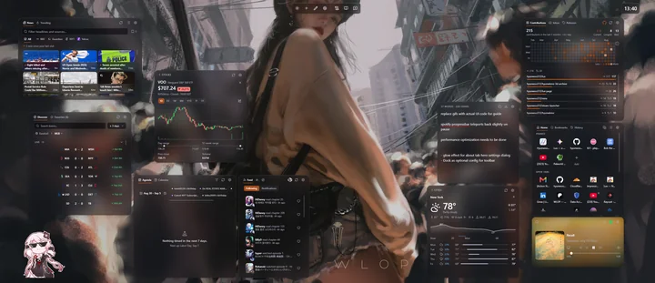

_One setup, with every widget sized and placed to taste._

> **Where your data lives**
>
> Your layout, notes and settings are stored in this browser. Widgets fetch straight from the services they show — weather, news, your calendar — and Lux keeps no copy of any of it on a server. Signing in to Microsoft or GitHub is the one exception: the last step passes through a small Lux relay, because those providers require a secret that cannot ship inside an extension. The relay completes the exchange and stores nothing. Google sign-in goes through Chrome itself and never reaches the relay.

[Read the privacy policy](https://lux.hyunwk.me/privacy)

### The toolbar

_The controls in the top-right corner are how you change the dashboard. Here they are, numbered to match the list below._

1. **Light and dark** — Flips between the two themes. The change sweeps across the page instead of snapping, and Lux remembers which one you chose.
2. **Add a widget** — Opens the widget palette. Pick anything from the list and it drops into the first free space on your grid — or drag it exactly where you want it.
3. **Edit your layout** — Turns on edit mode, where widgets can be dragged, resized and removed. Press it again — or hit `Esc` — when you are finished.
4. **Settings** — Everything that is not a widget: theme defaults, your wallpaper, connected accounts, keyboard shortcuts, and backing your setup up to a file.
5. **Release notes, this guide, and feedback** — The last three sit together. The scroll shows what changed in each version, the book opens this guide, and the message icon sends a note straight to the developer.

### Customizing your dashboard

_Nothing here is fixed. Put widgets where you want them, size them how you like, and give each one its own look._

Press the pencil in the toolbar to start editing. Drag a widget anywhere on the grid and the others move aside to make room; grab its bottom-right corner to make it bigger or smaller. Every widget gets a remove button while you are editing, and pressing the pencil again — or `Esc` — puts things back to normal.

  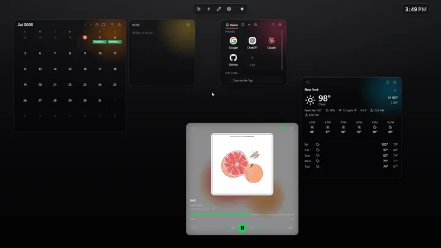

_Drag to move, drag the corner to resize._

Each widget also has its own settings, behind the gear in its header — you will find it when you are *not* in edit mode. That is where you switch it between the frosted glass look and a solid one, give it its own accent colour, and change whatever that particular widget offers. Widgets that fetch things, like Weather, Stocks and Calendar, also have a refresh button there.

  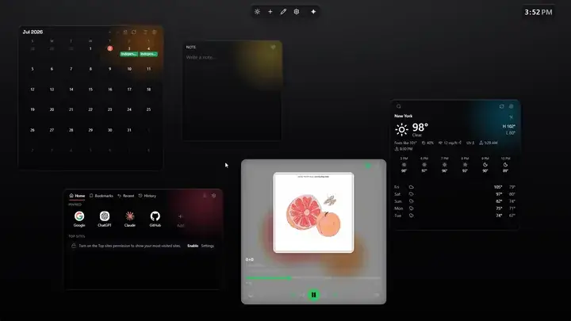

_Surface, accent and per-widget options all live here._

> **Want two of something?**
>
> You can add more than one of the same widget. Two notes, two clocks, a Weather for home and another for wherever you are travelling — add them the same way you added the first.

### Keyboard shortcuts

_Much of the dashboard can be driven from the keyboard, and every binding can be changed._

Shortcuts only fire when focus is outside a text field, so typing in a note or a search box will not trigger them by accident. `Esc` leaves edit mode.

_Edit keyboard shortcuts — in Settings._

## Widgets

### AniList

_Your anime and manga list, across three tabs._

Sign in to see your own list, or browse without signing in at all. Three tabs, and the widget remembers which one you left it on.

  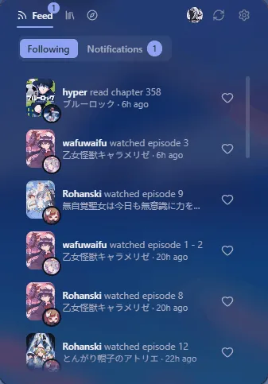

_Feed, Library and Discover, and the detail view behind a title._

**Feed** is what the people you follow are watching and reading, each with a one-tap like. **Notifications** sits beside it, with a count when something you follow airs or someone likes you back.

  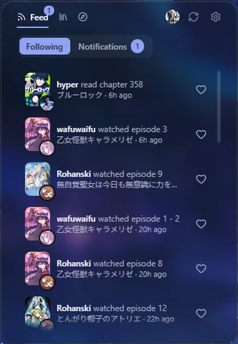

_Activity from the people you follow._

**Library** is your own list — progress, how far behind you are, and filters for status or for what is airing soon.

**Discover** searches anime and manga, sorts by popular, trending, score or upcoming, and lets you browse the covers. Anything already on your list is badged with where you left it.

  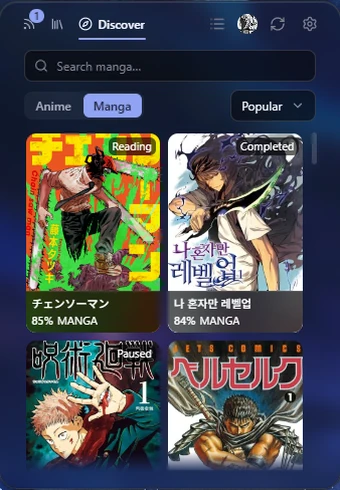

_Your own status, badged onto each cover._

Each widget carries a settings control in its own header, outside edit mode. That is where you choose whether it sits on glass or a solid surface, and which accent colour it uses. You can add more than one of the same widget.

### Calendar

_Google and Outlook events together, read-only, in two views._

**Agenda** puts the day on a time axis, with all-day items in a row above it.

  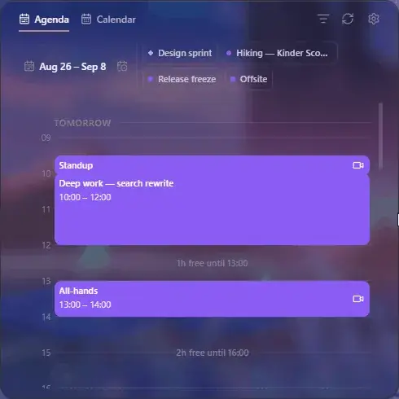

_The day, top to bottom._

The gaps get named too — *2h free until 14:00*, *Nothing until Thu, 09:00* — so you can read the shape of a day, not just its contents.

  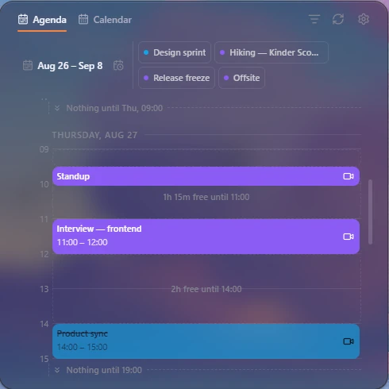

_Agenda view._

**Calendar** lays out the month instead, and today is marked.

  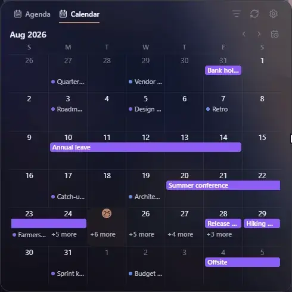

_Paging through the months._

Multi-day events draw as one continuous bar rather than repeating, and a busy day collapses to **+N more**.

  

_Calendar view._

Events keep their join link for Meet or Teams, show your RSVP with pending invitations flagged, and open on the provider's site if you need the full detail.

Each widget carries a settings control in its own header, outside edit mode. That is where you choose whether it sits on glass or a solid surface, and which accent colour it uses. You can add more than one of the same widget.

### GitHub

_Three views of your GitHub activity._

Your GitHub activity without opening GitHub — what you have shipped, and what is waiting on you.

  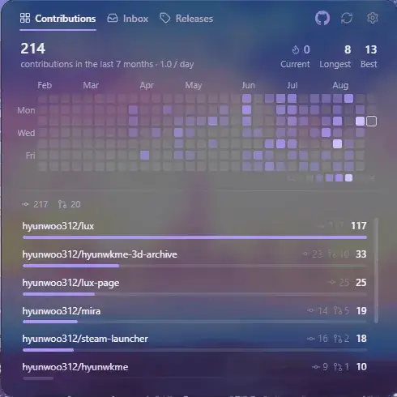

_Contributions, Inbox and Releases._

**Contributions** is the heatmap, your current and longest streaks, and which repositories the work actually went into — ranked, with commits and pull requests counted separately.

  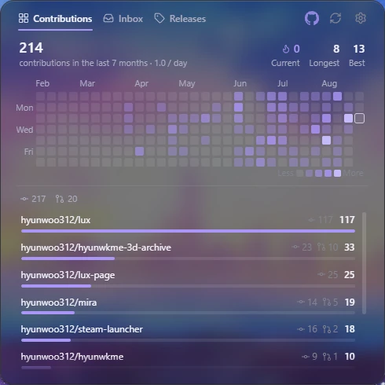

_Where the year's work went._

**Inbox** collects open pull requests, issues and unread notifications, grouped by repository. Filter to just one kind, or mark the lot as read.

  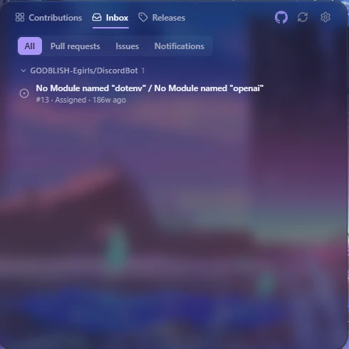

_What is waiting on you._

**Releases** lists the newest version from each repository you watch, newest first.

Each widget carries a settings control in its own header, outside edit mode. That is where you choose whether it sits on glass or a solid surface, and which accent colour it uses. You can add more than one of the same widget.

### Image

_Your own photos, as a single image or a slideshow._

Point it at a set of pictures and it crossfades through them on a timer you choose.

  

_A slideshow crossfading through a set._

One picture works just as well as a set. Either way they are stored in your browser and never uploaded — add them from the widget's own settings, where you also set how long each one stays up.

Each widget carries a settings control in its own header, outside edit mode. That is where you choose whether it sits on glass or a solid surface, and which accent colour it uses. You can add more than one of the same widget.

### Mail

_Gmail and Outlook inboxes in one list, headers only._

Your Gmail and Outlook inboxes merged into one list, newest first and grouped by how recently each message arrived. Each row shows the sender with their initials, the subject, the first couple of lines, and how long ago it arrived, with a paperclip when something is attached. Unread messages sit at full strength; ones you have read fade back.

**All**, **Gmail** and **Outlook** switch between the merged list and one mailbox at a time, and each tab carries a badge counting what is unread behind it. All keeps both in true date order as you scroll, fetching more from whichever mailbox is busier. The search above the list queries your whole inbox on the server, not just the messages already loaded, and the widget settings choose how many arrive per load.

Lux reads your mail but never writes to it — nothing you do here can change a message, and opening one hands you to Gmail or Outlook rather than showing it in the widget.

Connect either mailbox, or both. If one provider fails to load, the other still shows and the widget says which one is missing.

Each widget carries a settings control in its own header, outside edit mode. That is where you choose whether it sits on glass or a solid surface, and which accent colour it uses. You can add more than one of the same widget.

### News

_Headlines from six publishers, merged or one tab each._

Headlines from Google News, the BBC, The Guardian, the NYT, NPR and Yahoo. Stories open on the publisher's own site — Lux never reposts anyone's article.

  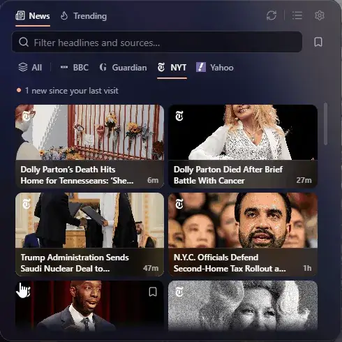

_Switching sources, searching, and saving a story for later._

**News** gives a tab per publisher you enable, plus **All**, which merges them and folds duplicate coverage of the same story together. A dot marks what is new since your last visit, and the bookmark keeps anything worth coming back to.

  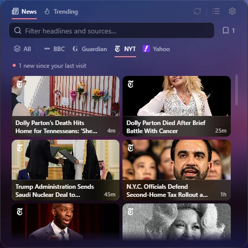

_Headlines from one source._

**Trending** is what is being searched right now, straight from Google Trends, for the country you pick.

  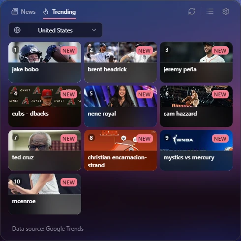

_What the country is searching._

The filter box narrows what is already loaded by headline or publisher; on the Google News tab it searches instead.

Each widget carries a settings control in its own header, outside edit mode. That is where you choose whether it sits on glass or a solid surface, and which accent colour it uses. You can add more than one of the same widget.

### Note

_A plain-text scratch note, saved as you type._

Somewhere to put the thing you will need in ten minutes. There is no save button because there is nothing to save to — the text stays in this browser.

  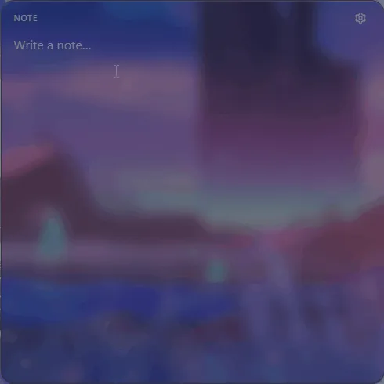

_Typing into a note._

The header keeps a running word and character count, with copy and download beside it. Each note widget is its own note, so keep as many as you like — one for the day, one for scratch, one for whatever you keep forgetting.

Each widget carries a settings control in its own header, outside edit mode. That is where you choose whether it sits on glass or a solid surface, and which accent colour it uses. You can add more than one of the same widget.

### Quick Access

_Links you pin yourself, alongside the lists the browser keeps._

Three tabs, and everything in them shows as favicon tiles or a plain list — whichever you prefer.

  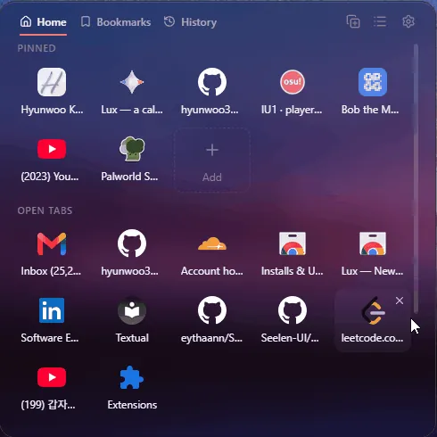

_Pinned links and open tabs, your bookmark folders, and where you have been._

**Home** holds the links you pinned, plus the tabs you have open right now. Drag a pin to reorder it; hover one to rename or remove it.

  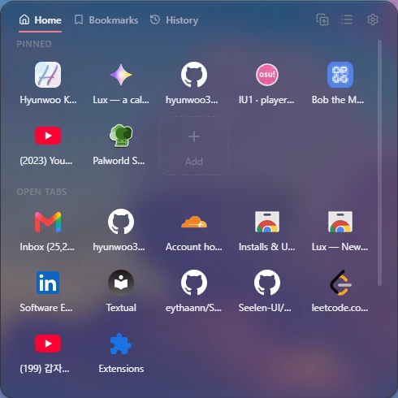

_Pins on top, open tabs below._

**Bookmarks** is your real bookmark tree, folders and all. Search across the lot, or follow the breadcrumb down into a folder.

**History** is recently visited sites, searchable. Anything worth keeping can be pinned to Home from here.

  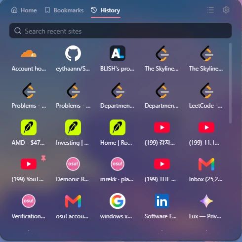

_Recent sites, with one pinned._

> **Browser lists ask permission first**
>
> Bookmarks, recently closed tabs, history and most-visited sites each ask for their own permission the first time you use them. Nothing is read until you agree, and you can decline and still use pinned links.

Each widget carries a settings control in its own header, outside edit mode. That is where you choose whether it sits on glass or a solid surface, and which accent colour it uses. You can add more than one of the same widget.

### Sports

_Scores for the leagues and teams you follow._

Scores and fixtures across soccer, football, basketball, baseball, hockey, tennis and golf. Pick a league to browse, or star the teams you actually care about and let them collect in one place.

  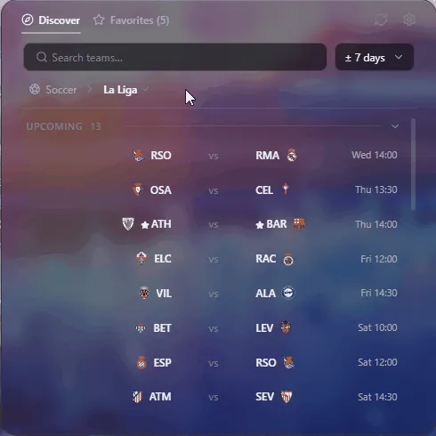

_Browse by sport, search any team, star it to follow._

**Discover** is the whole league, grouped into live, upcoming and final. Teams you follow are starred in place — the rest of the fixtures stay exactly where they are.

  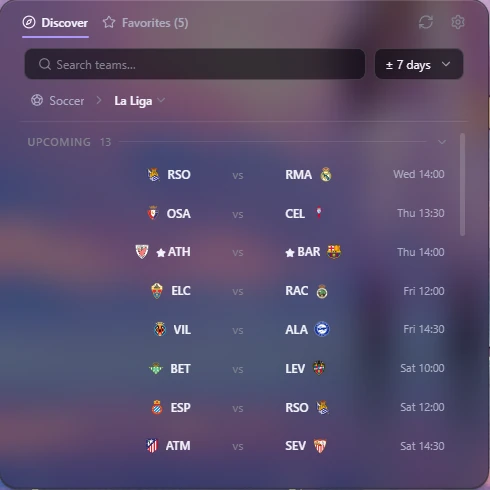

_A league in full, your teams starred._

**Favourites** narrows to only the games your starred teams are in, split by league. A team with nothing on reads as *No game* rather than vanishing.

  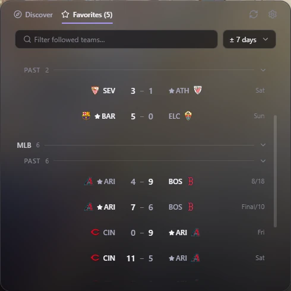

_The same day, down to your teams._

Search reaches every league at once, so typing part of a name finds the club wherever it plays. The date control widens the window a few days either side of today when nothing is on.

Opening a game gives the line score, probable starters beforehand and top performers during, plus live detail while it runs — bases, count and outs for baseball.

Each widget carries a settings control in its own header, outside edit mode. That is where you choose whether it sits on glass or a solid surface, and which accent colour it uses. You can add more than one of the same widget.

### Spotify

_What is playing, with controls._

The whole transport is here — shuffle, skip, repeat, volume and device switching — alongside the playlist or album the track came from. The backdrop picks up the album art's colour, so the widget shifts with whatever is on.

  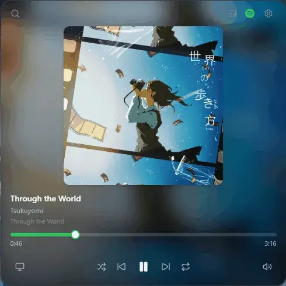

_Search reaches your library and Spotify's catalogue; pick a result to play it._

The layout follows the widget's height rather than a setting. Give it room and the artwork leads.

  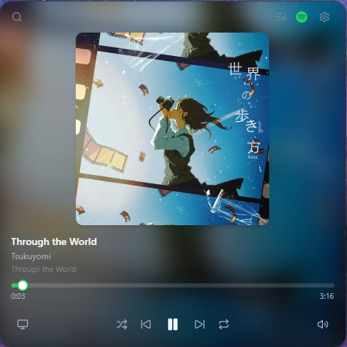

_Room to breathe._

Flatten it and the same controls fold into a single bar, artwork and all.

  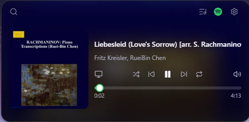

_The same player, short._

The queue button in the widget header swaps the player for what is coming next.

> **Controls need Spotify Premium**
>
> Changing playback — skipping, pausing, switching device — requires a Premium account. That is a restriction in Spotify's own API, not something Lux can work around. Seeing what is playing works either way.

Each widget carries a settings control in its own header, outside edit mode. That is where you choose whether it sits on glass or a solid surface, and which accent colour it uses. You can add more than one of the same widget.

### Stocks

_A watchlist with live prices and a chart._

A watchlist you build yourself, by ticker or by company name.

  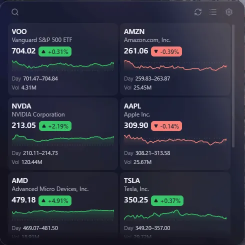

_Each match shows which exchange it trades on._

Every holding carries its price, the day's move, a sparkline, and the day's range and volume — as a card grid or a plain list, whichever reads better at the size you gave the widget. Drag to reorder, and hover a holding to drop it.

  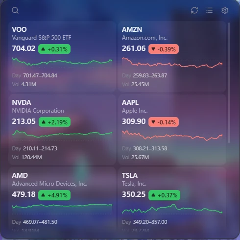

_The watchlist as a card grid._

Opening one gives an interactive chart from a day out to five years, with the day's range, the 52-week range and volume. An optional strip above the watchlist carries the S&P 500, Nasdaq and Dow.

Each widget carries a settings control in its own header, outside edit mode. That is where you choose whether it sits on glass or a solid surface, and which accent colour it uses. You can add more than one of the same widget.

### Tasks

_A to-do list that stays on this machine._

Type to add, tick to complete, drag to reorder.

  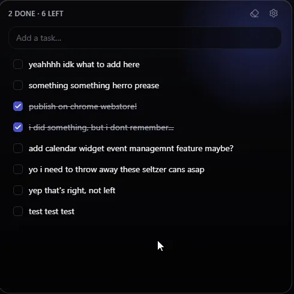

_Drag a row to move it; hover one for edit and delete._

Completed items strike through and stay where they are until you clear them. The header keeps a running done and left count, and clears the finished ones in a tap.

Each widget carries a settings control in its own header, outside edit mode. That is where you choose whether it sits on glass or a solid surface, and which accent colour it uses. You can add more than one of the same widget.

### Weather

_Current conditions and forecasts for the places you add._

Add as many places as you like. Each sits in the list with its temperature and the day's high and low.

  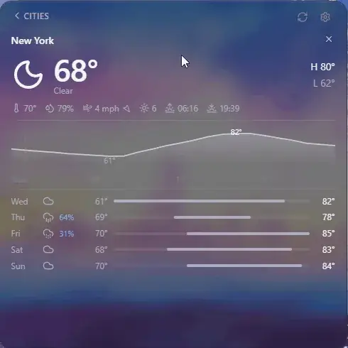

_Searching for a city to add._

Opening one gives the full picture — feels-like, humidity, wind, UV, sunrise and sunset, an hourly curve and the next five days.

> **Lux never asks where you are**
>
> You type a place name and Lux looks up its coordinates once, then remembers them. The extension holds no location permission and never calls the browser's geolocation API.

Each widget carries a settings control in its own header, outside edit mode. That is where you choose whether it sits on glass or a solid surface, and which accent colour it uses. You can add more than one of the same widget.

## Accounts & privacy

### Connecting an account

_Calendar, Spotify, GitHub and AniList can pull in what is yours. Each asks separately, and only when you tell it to._

A widget that needs an account shows a **Connect** button. Press it and you sign in on the provider's own site — your password never touches Lux, and all that comes back is a token.

#### What each one is allowed to see

- **Google Calendar** — Read-only access to your calendars, plus your email address so the widget can show which account it is using. It cannot create, move or delete anything.
- **Outlook** — The same read-only calendar access, through Microsoft.
- **Spotify** — What is playing, control over it, and your library and playlists so search and the queue work. Controlling playback needs Premium — Spotify's rule for every app, not ours.
- **GitHub** — Your profile, notifications, and repository access — the broad-sounding one on GitHub's consent screen, which is what lets private contributions count towards your heatmap. Lux only reads with it.
- **AniList** — Your list, progress and notifications. The only one that writes as well as reads — liking something or bumping an episode count, and only when you do it.

Microsoft and GitHub finish sign-in through a small Lux relay, because those two need a secret that cannot live inside an extension. Google signs in through Chrome, and Spotify and AniList talk to your browser directly. The relay keeps nothing.

Tokens expire after an hour or so and Lux renews them in the background, so you should not have to sign in again.

> **What disconnecting actually does**
>
> Disconnecting deletes the token from this browser, so Lux stops fetching straight away. It does **not** revoke access at the provider — Lux stays listed among your authorised apps until you remove it there too.

_Open Accounts & Permissions — in Settings._
