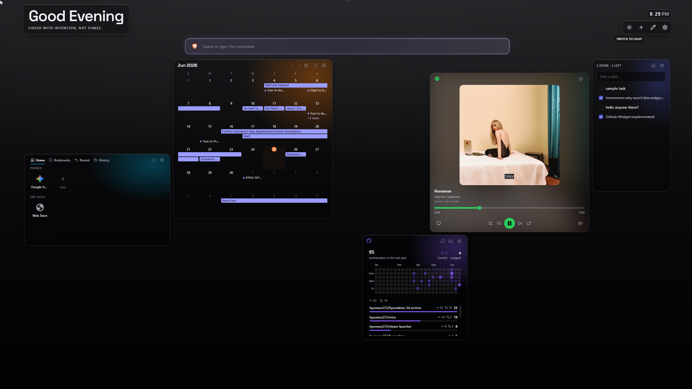

  
  <h1>Lux</h1>
  
A customizable new tab dashboard for Chrome and Brave — widgets and much more.

  

    
    
    
    
    
  

  

## What it is

Lux turns every new tab into a dashboard you actually want to look at — a grid of widgets you
arrange yourself and a glassmorphic look that adapts to light and dark. It runs entirely in your
browser.

## Install

- **Chrome Web Store** — coming soon (the recommended way to install).
- **From source** _(not recommended — for development only)_ — build it yourself and load the
  unpacked `dist/` folder. See [CONTRIBUTING.md](CONTRIBUTING.md#running-it-yourself).

## Features

- **A widget dashboard you arrange.** Drag, drop, and resize widgets on a grid — each with its
  own Glass or Solid surface and accent.
- **Made to look good.** A light / dark glassmorphism theme with a smooth theme-switch
  transition, and accent color used only where it actually signals something.
- **Configurable and yours.** Tune everything from a settings panel; optional account widgets
  connect over OAuth only when you want them.

### Widgets

_A full rundown of each widget is coming soon._ Lux currently ships: Tasks, Quick Access, Image,
Calendar (Google & Outlook), Spotify, and GitHub.

## Privacy

Lux is local-first: your dashboard data lives in `chrome.storage.local` and never leaves your
browser. No Lux account, no telemetry. The only Lux-operated backend is a minimal, stateless
OAuth sign-in relay used solely to complete sign-in for providers that require it — it stores
nothing. Full policy: <https://lux.hyunwk.me>.

## Contributing

Lux is maintained solo and isn't taking pull requests right now — but bug reports are welcome,
and you're free to fork it under MIT. See [CONTRIBUTING.md](CONTRIBUTING.md).

## License

[MIT](LICENSE) © Hyunwoo Kim
