

  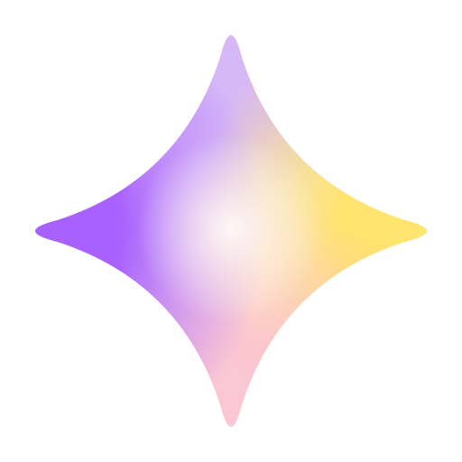
  <h1>Lux</h1>
  
A private, customizable new tab dashboard for Chrome and Brave.

  

    
    
    
    
    
  

  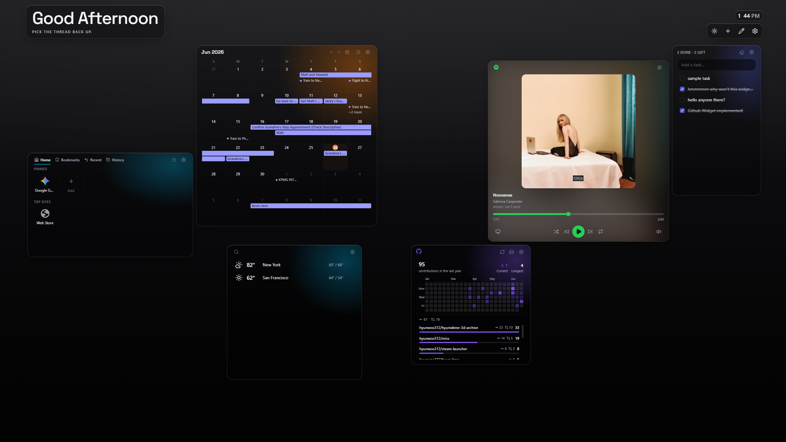
  

## What it is

Lux turns every new tab into a dashboard you actually want to look at — a grid of widgets you
arrange yourself and a glassmorphic look that adapts to light and dark. It runs entirely in your
browser: no account, no tracking, nothing to sign up for.

## Install

- **Chrome Web Store** — **[Install Lux](https://chromewebstore.google.com/detail/lux/kmfabjnibncbooljgbkinkfddapmfcna)** (recommended). Works in Chrome and Brave.
- **From source** _(development only)_ — build it yourself and load the unpacked `dist/` folder.
  See [CONTRIBUTING.md](CONTRIBUTING.md#running-it-yourself).

## Features

- **A widget dashboard you arrange.** Drag, drop, and resize widgets on a grid — each with its
  own Glass or Solid surface and accent.
- **Made to look good.** A light / dark glassmorphism theme with a smooth theme-switch
  transition, and accent color used only where it actually signals something.
- **Configurable and yours.** Tune everything from a settings panel, back up your whole setup to
  a file, and restore it anywhere.

## Widgets

Widgets are the heart of Lux: pick the ones that fit how you work, arrange them however you like,
and skip the rest. Most run entirely on your device, and a few connect to an account only when you
choose.

### AniList

Your anime and manga life across three tabs — sign in with AniList, or browse trending titles
first.

- **Activity** — a feed of what the people you follow are reading and watching, with one-tap likes.
- **Current** — your library with progress and exactly how far behind you are, filterable by anime
  or manga and sortable.
- **Inbox** — your AniList notifications: airing updates, new additions, and likes.

  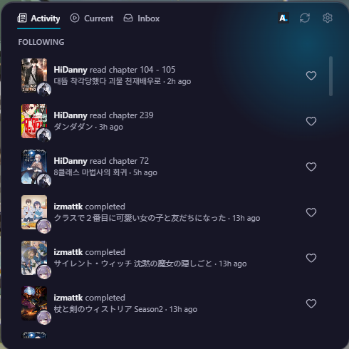
  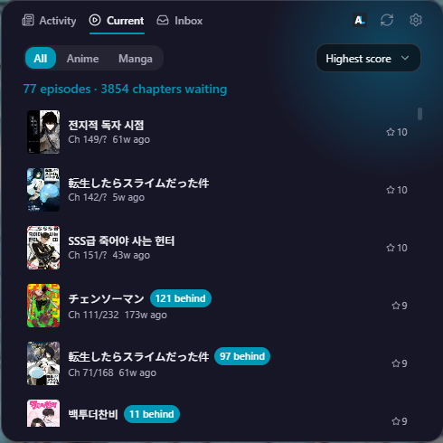
  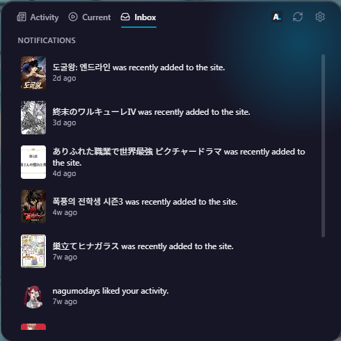

### Calendar

Your Google and Outlook events together — read-only, on every new tab. Switch between a calendar
grid and a list view to match how you like to scan.

- **Calendar view.** A full grid with multi-day events as continuous bars, a "+N more" overflow,
  and today highlighted.
- **List view.** Flip to a chronological agenda when you'd rather just scan what's next.

  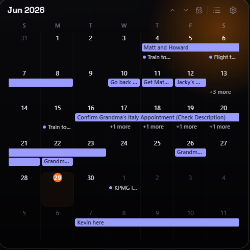
  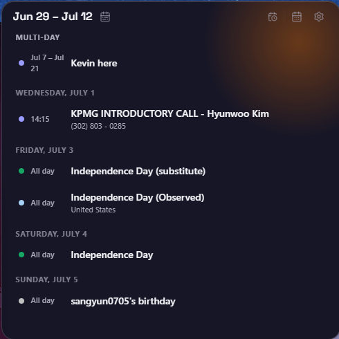

  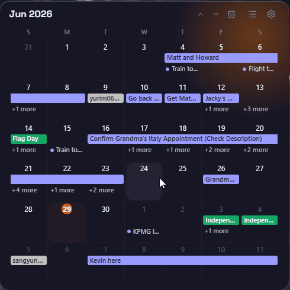
  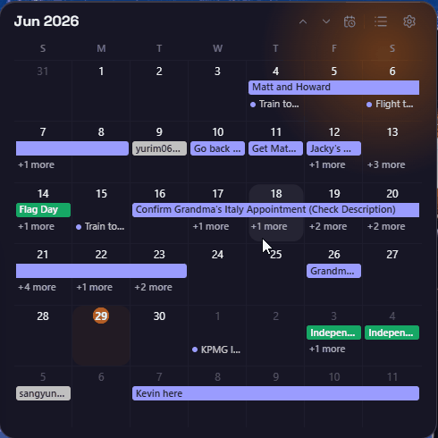

### GitHub

Your GitHub activity at a glance — toggle between two views right on your new tab:

- **Contributions** — your full-year contribution heatmap with current and longest streaks, your
  yearly total, and a per-repository breakdown of commits and pull requests.
- **Inbox** — your open pull requests and unread notifications together, so a review request or a
  mention never slips by.

  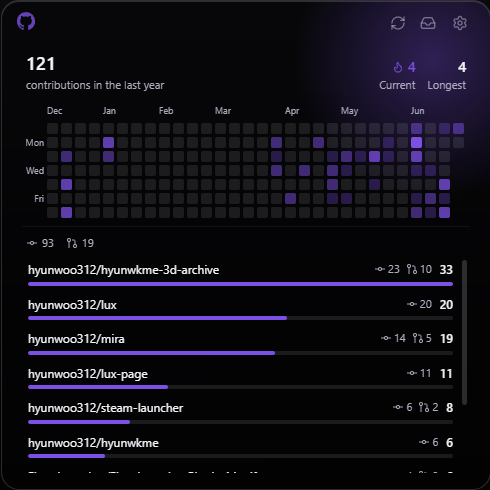
  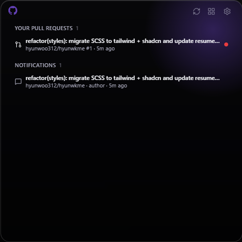

### Image

Your own photos on the new tab — show a single image, or a slideshow that fades through a set on a
timer.

  
  

### Note

A no-fuss scratch note: plain text, saved as you type, and always a click away — it never leaves
your browser.

  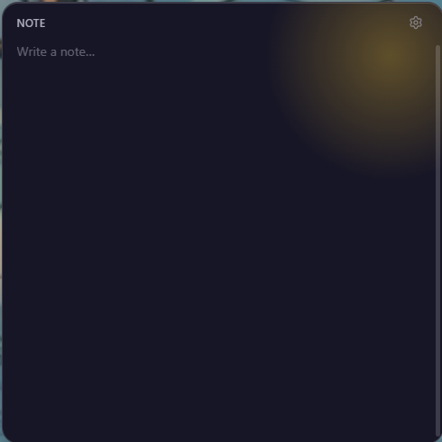
  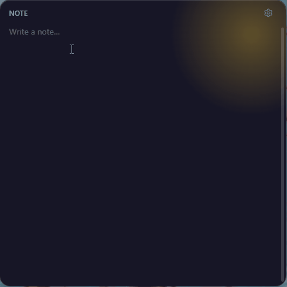

### Quick Access

Your launchpad for the sites you actually use — pinned links alongside your bookmarks, history, and
most-visited sites.

- **Pin what matters.** Add links as favicon tiles, drag to reorder, and switch between grid and
  list.
- **Or pull from the browser.** Tabs for your bookmarks, recently closed tabs, and history — each
  opt-in by permission.

  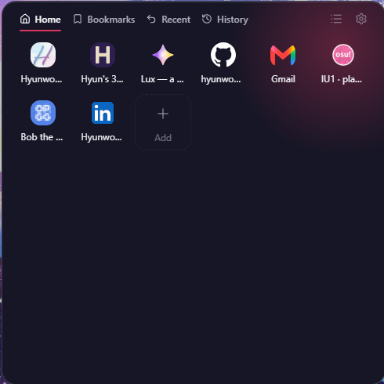
  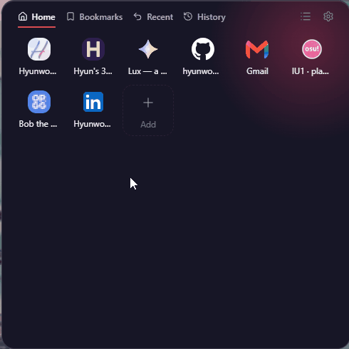

### Spotify

Your music without the tab-switching (Spotify Premium required to control playback).

- **Full now-playing.** Album art, a scrubber, and the whole transport — shuffle, skip, repeat,
  volume, and device switching.
- **Search to play.** Find a track in your library and switch to it on the spot.

  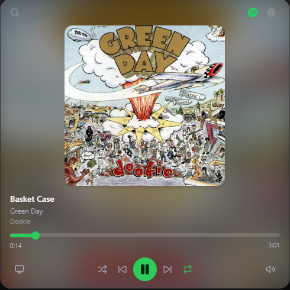
  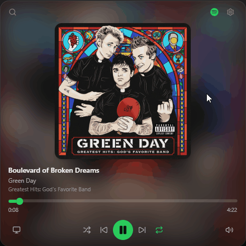

### Tasks

A fast, local to-do list — no account, nothing synced anywhere.

- **Add, check off, reorder.** Type to add, click to complete (with a running done / left count),
  and drag to reorder.
- **Stays tidy.** Completed items strike through and clear in a tap.

  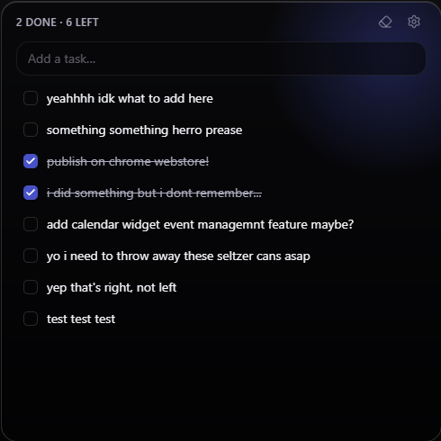
  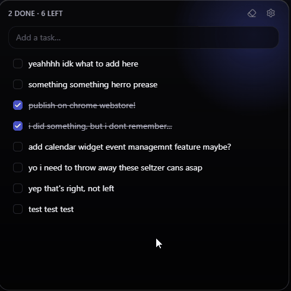

### Weather

Current conditions and forecasts with no account and no API key — just add the places you care
about.

- **Your cities** — a saved list showing each city's current temperature and the day's high and
  low at a glance, with day and night icons.
- **City detail** — feels-like, humidity, wind, UV, sunrise and sunset, plus an hourly strip and a
  multi-day forecast.

  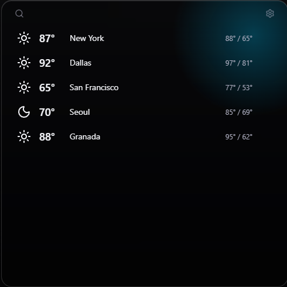
  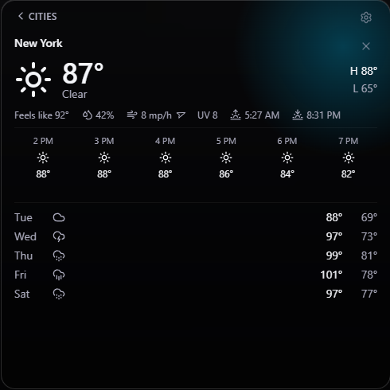

## Connecting accounts

Some widgets can connect to your accounts over OAuth — only when you choose. That data is fetched
straight from the provider to your browser and is never sent to a Lux server:

- **Google Calendar / Outlook** — read-only calendar events.
- **Spotify** — now playing and playback control (Premium to control).
- **GitHub** — contributions and notifications.
- **AniList** — library, progress, and notifications.

> **Heads-up for early users (Google):** Lux's Google verification is still in review, so
> connecting **Google Calendar** may show a "Google hasn't verified this app" screen. It's safe
> to continue — choose **Advanced**, then **Go to lux.hyunwk.me**. Lux only requests read-only
> calendar access, and your calendar data never touches a Lux server.

## Privacy

Lux is local-first: your dashboard data lives in `chrome.storage.local` and never leaves your
browser. No Lux account, no telemetry. The only Lux-operated backend is a minimal, stateless
OAuth token relay used solely to complete sign-in and refresh access tokens for providers that
require it — it stores nothing. Full policy: <https://lux.hyunwk.me/privacy>.

## Contributing

Lux is maintained solo and isn't taking pull requests right now — but bug reports are welcome,
and you're free to fork it under MIT. See [CONTRIBUTING.md](CONTRIBUTING.md).

## License

[MIT](LICENSE) © Hyunwoo Kim
