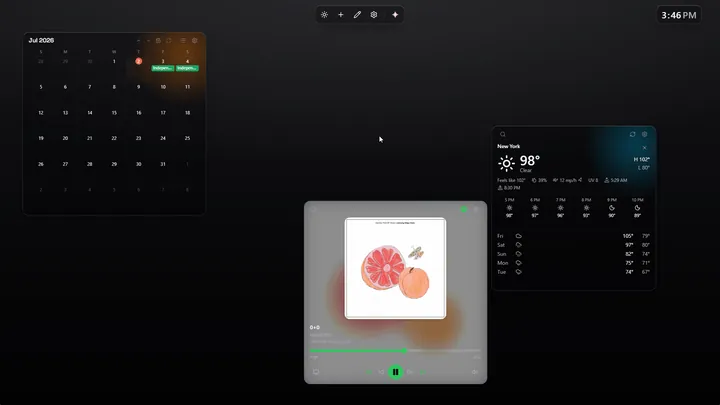

  
  <h1>Lux</h1>
  
A private, customizable new tab dashboard for Chrome and Brave.

  

    
    
    
    
    
  

  

## What it is

Lux replaces the new tab page with a dashboard — a grid of widgets you arrange yourself, in a
glassy light or dark theme. It runs in your browser, and there's no Lux account to sign up for.

## Install

- **Chrome Web Store** — **[Install Lux](https://chromewebstore.google.com/detail/lux/kmfabjnibncbooljgbkinkfddapmfcna)** (recommended). Works in Chrome and Brave.
- **From source** _(development only)_ — build it yourself and load the unpacked `dist/` folder.
  See [CONTRIBUTING.md](CONTRIBUTING.md#running-it-yourself).

## Features

- **Widgets on a grid.** Drag, drop, and resize them. Each one has a Glass or Solid surface and its
  own accent color.
- **Light and dark.** Both themes are glass-styled, and the accent color is kept for things that
  signal state — selected, live, destructive.
- **Settings and backup.** Options live in one panel, and you can export your whole setup to a file
  and import it again later.
- **Command palette.** `Alt+T` from any tab opens one box for your widgets, your bookmarks and
  history, your open tabs, and the web. Run a widget without touching it.
- **Keyboard shortcuts.** Settings, the widget palette, layout editing, grid lines, and the theme
  each have one, and you can rebind them — two bindings per action. The palette's `Alt+T` is
  registered with Chrome, so change it at `chrome://extensions/shortcuts`.

## Using Lux

Everything lives on the new tab. The toolbar reads left to right as things you do — theme, add
widget, edit layout, search — then the dialogs: settings, release notes, the guide, and feedback.
The rest of the page is your dashboard.

  

Add a widget and click to drop it, hit edit to drag and resize, and open a widget's own header gear
for its surface, accent, and options. Settings holds the theme, wallpaper, and backup. The
magnifying glass — or `Alt+T` from anywhere — opens the command palette.

**[Read the guide →](GUIDE.md)** — the same pages Lux shows in-extension, with a screenshot for
every widget. Open it in Lux from the book icon in the toolbar.

## Widgets

Twelve to choose from, and you can add more than one of the same kind. Most work on their own;
AniList, Calendar, GitHub, and Spotify need you to connect that account first — see
[Connecting accounts](#connecting-accounts).

|                                      |                               |                             |
| ------------------------------------ | ----------------------------- | --------------------------- |
| [AniList](GUIDE.md#anilist)          | [Calendar](GUIDE.md#calendar) | [GitHub](GUIDE.md#github)   |
| [Image](GUIDE.md#image)              | [News](GUIDE.md#news)         | [Note](GUIDE.md#note)       |
| [Quick Access](GUIDE.md#quickAccess) | [Sports](GUIDE.md#sports)     | [Spotify](GUIDE.md#spotify) |
| [Stocks](GUIDE.md#stocks)            | [Tasks](GUIDE.md#tasks)       | [Weather](GUIDE.md#weather) |

## Connecting accounts

Four widgets can connect to an account over OAuth, each only when you start the connection:

- **Google Calendar / Outlook** — read-only calendar events.
- **Spotify** — what's playing, and playback control.
- **GitHub** — contributions and notifications.
- **AniList** — library, progress, and notifications.

Requests go from your browser to the provider, and you can disconnect any of them from settings.

## Privacy

Your dashboard lives on your machine: layout, widget settings, and account tokens are kept in
`chrome.storage.local`. There's no Lux account and no analytics of any kind.

The one server Lux operates is a small stateless relay. It does two jobs — completing sign-in and
refreshing tokens for the providers whose token exchange needs a client secret (Google, Microsoft,
GitHub), and forwarding feedback you write and submit yourself — and it stores nothing. Everything
else talks to the provider directly from your browser.

Full policy: <https://lux.hyunwk.me/privacy>.

## Contributing

Lux is maintained solo and isn't taking pull requests right now, but bug reports are welcome, and
you're free to fork it under Apache 2.0 — keep `LICENSE` and `NOTICE`, and ship under a
different name. See [CONTRIBUTING.md](CONTRIBUTING.md).

## License

[Apache 2.0](LICENSE) © Hyunwoo Kim
