

  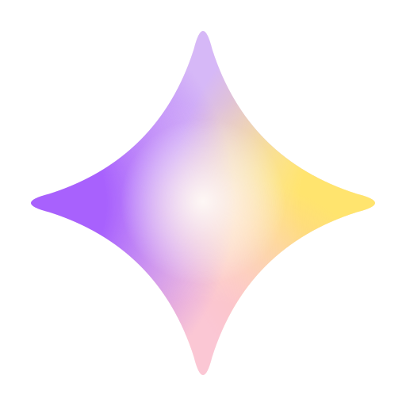
  <h1>Lux</h1>
  
A private, customizable new tab dashboard for Chrome and Brave.

  

    
    
    
    
    
  

  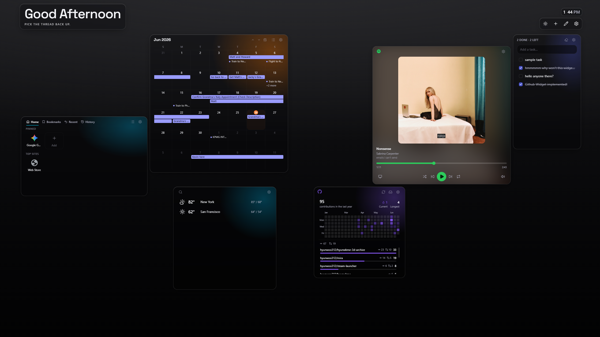
  

## What it is

Lux replaces the new tab page with a dashboard — a grid of widgets you arrange yourself, in a
glassy light or dark theme. It runs in your browser, and there's no Lux account to sign up for.

## Install

- **Chrome Web Store** — **[Install Lux](https://chromewebstore.google.com/detail/lux/kmfabjnibncbooljgbkinkfddapmfcna)** (recommended). Works in Chrome and Brave.
- **From source** _(development only)_ — build it yourself and load the unpacked `dist/` folder.
  See [CONTRIBUTING.md](CONTRIBUTING.md#running-it-yourself).

## Features

- **Widgets on a grid.** Drag, drop, and resize them. Each one has a Glass or Solid surface and its
  own accent color.
- **Light and dark.** Both themes are glass-styled, and the accent color is kept for things that
  signal state — selected, live, destructive.
- **Settings and backup.** Options live in one panel, and you can export your whole setup to a file
  and import it again later.
- **Keyboard shortcuts.** Settings, the widget palette, layout editing, grid lines, and the theme
  each have one, and you can rebind them — two bindings per action.

## Using Lux

Everything lives on the new tab. The toolbar at the top has theme, add widget, edit layout,
settings, what's new, and feedback; the rest of the page is your dashboard.

### Add a widget

Click **Add widget** in the toolbar to open the widget menu. Hover an item to preview where it will
land, then **click to drop it there** — or **drag it onto the grid** to place it yourself.

  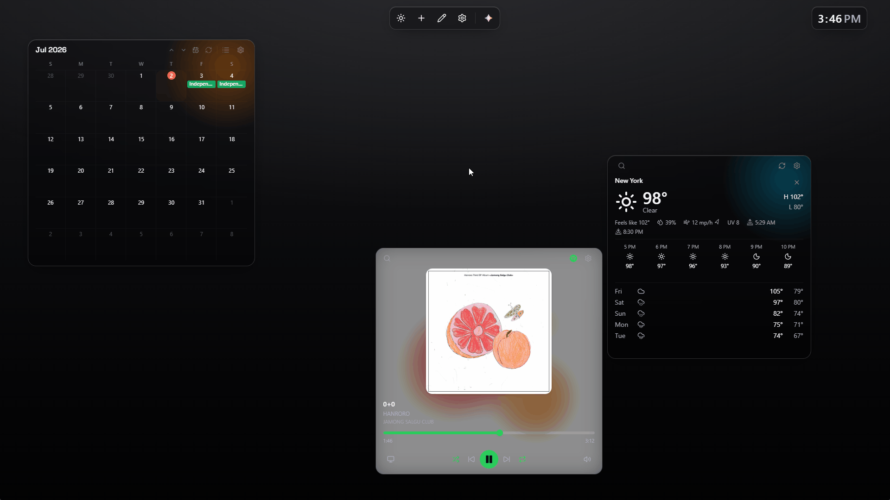

### Arrange the grid

Hit **edit** to rearrange. Drag a widget to move it, or drag its bottom-right corner to resize —
the grid reflows around it, and each widget gets a remove button while you're editing.

  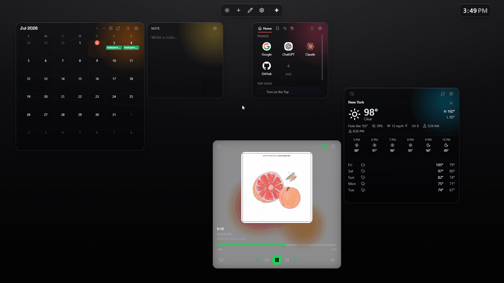

### Widget settings

Open a widget's settings from the gear on its header: switch its surface between **Glass** and
**Solid**, pick an accent, and set the options for that widget. Data widgets like Weather, Stocks,
and Calendar also have a manual refresh.

  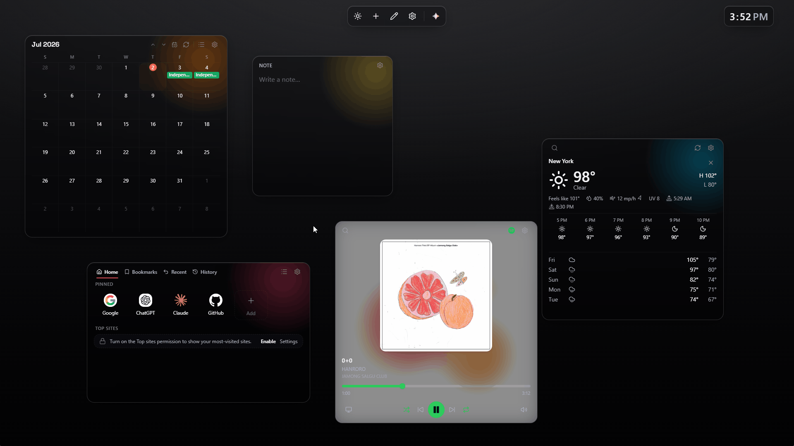

### Theme, wallpaper, and backup

Open **settings** to switch between light and dark, set a wallpaper, and change defaults. You can
also export your setup to a file and import it to restore everything on another machine.

  

## Widgets

Twelve to choose from, and you can add more than one of the same kind. Most work on their own;
AniList, Calendar, GitHub, and Spotify need you to connect that account first — see
[Connecting accounts](#connecting-accounts).

### AniList

Your anime and manga list, across four tabs. Sign in to see your own, or browse trending titles
without signing in.

- **Activity** — what the people you follow are watching and reading, with one-tap likes.
- **Library** — your list with progress and how far behind you are. Filter by status or what's
  airing soon, sort it, and page through as you scroll.
- **Inbox** — AniList notifications: airing updates, new additions, and likes.
- **Discover** — trending, popular this season, top rated, and upcoming, each marked with what's
  already on your list.

  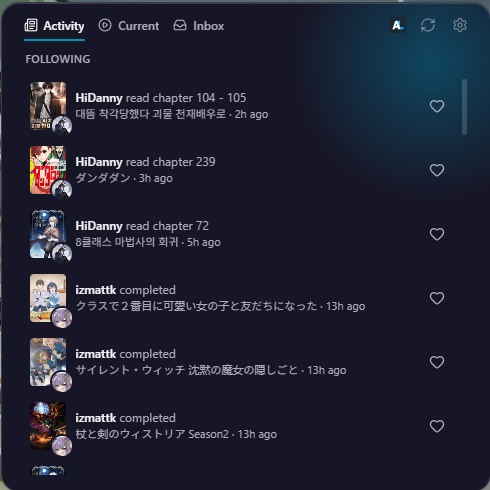
  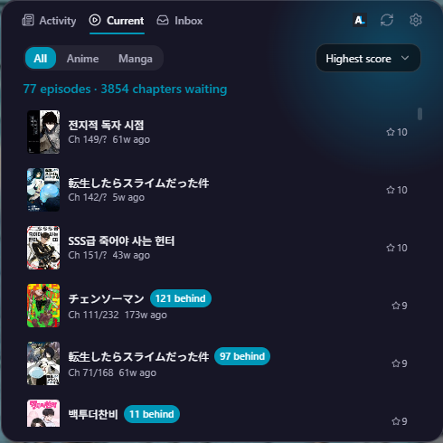
  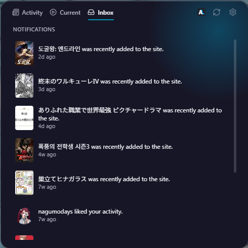

### Calendar

Google and Outlook events together, read-only, in two views.

- **Calendar** — a month grid with multi-day events as continuous bars, a "+N more" overflow, and
  today highlighted.
- **List** — the same events as a chronological agenda.
- **Meetings** — events carry a join link for Meet, Teams, and others, show your RSVP with pending
  invitations flagged, and tell you how long you're free before the next one.

  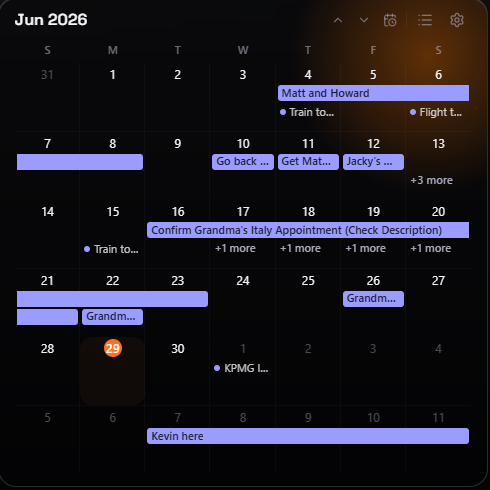
  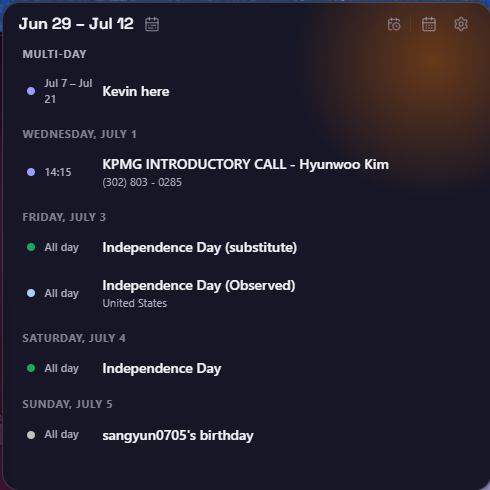

  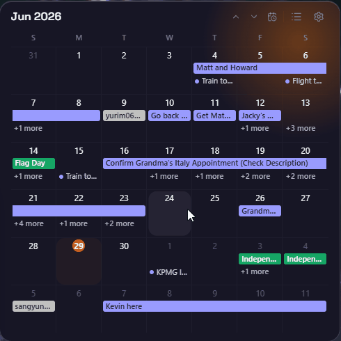
  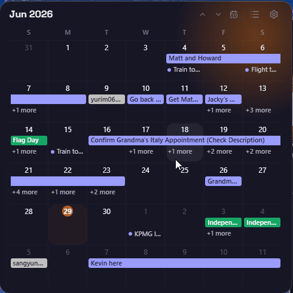

### GitHub

Three views of your GitHub activity.

- **Contributions** — the year's contribution heatmap with current and longest streaks, your
  yearly total, and a per-repository breakdown of commits and pull requests.
- **Inbox** — your open pull requests and unread notifications in one list.
- **Releases** — the latest versions from the repositories you watch, newest first.

  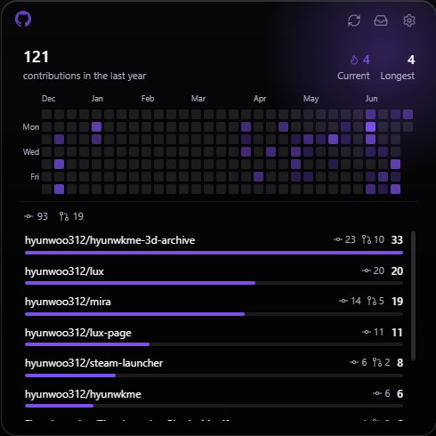
  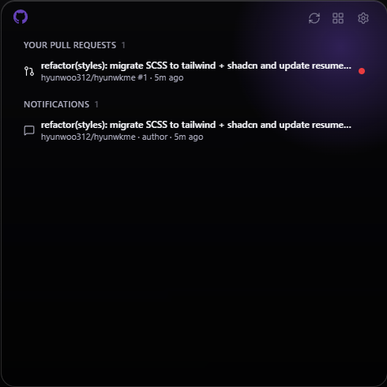

### Image

Your own photos — a single image, or a slideshow that fades through a set on a timer.

  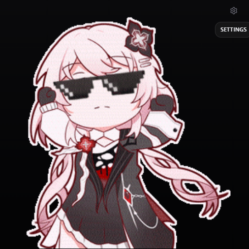
  

### News

Headlines from Google News, The New York Times, the BBC, The Guardian, NPR, and Yahoo News. Stories
open on the publisher's own site.

- **Sources** — a tab for each publisher you enable, plus an **All** tab that merges them and
  folds duplicate coverage of the same story together.
- **Topics and regions** — World, Business, Technology, and more where a source offers them, in
  US, UK, Australian, or international editions.
- **Search and filter** — search a topic on the Google News tab; on the others, narrow what's
  loaded by headline or publisher.

  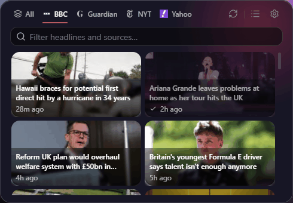
  

### Note

A plain-text scratch note, saved as you type.

  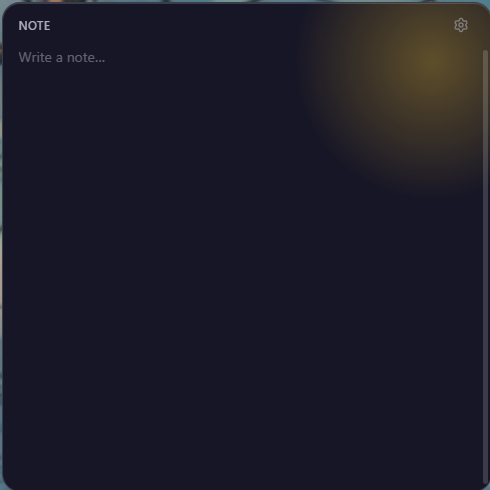
  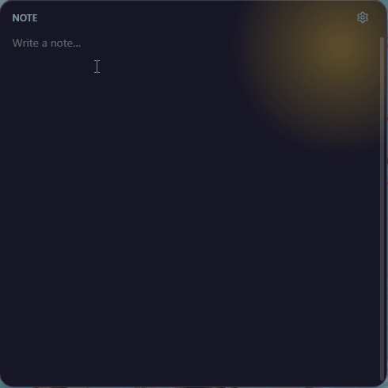

### Quick Access

Links you pin yourself, alongside the lists the browser already keeps.

- **Pinned links** — favicon tiles you can drag to reorder, shown as a grid or a list.
- **From the browser** — bookmarks (browsable folder by folder), recently closed tabs, history,
  and most-visited sites. Each asks for its permission the first time you use it.

  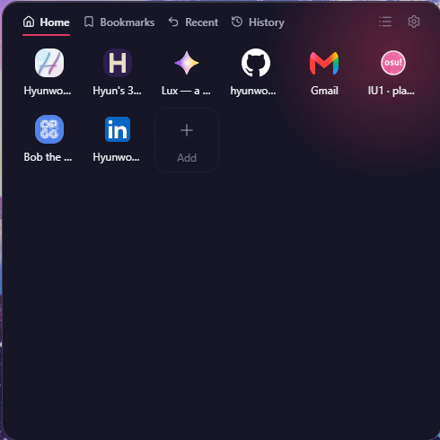
  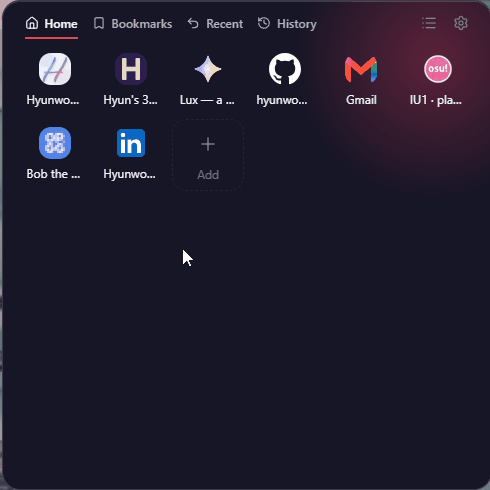

### Sports

Scores for the leagues and teams you follow.

- **Leagues and teams** — NFL, NBA, WNBA, MLB, and NHL. Follow a whole league, or only the teams
  you pick.
- **Filters** — show live, upcoming, or final games, across today or a few days either side.
- **Game detail** — the line score, probable starters before the game and top performers during
  it, and live detail while it plays, including bases, count, and outs for baseball.

  
  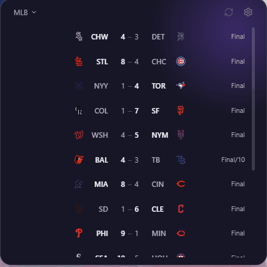

### Spotify

What's playing, with controls. Changing playback needs Spotify Premium — that's a restriction on
Spotify's API.

- **Now playing** — album art, a scrubber, and the transport: shuffle, skip, repeat, volume, and
  device switching, plus the playlist or album the track is playing from.
- **Search** — find a track in your library and switch to it.
- **Queue** — see what's coming next and jump to a track in it.

  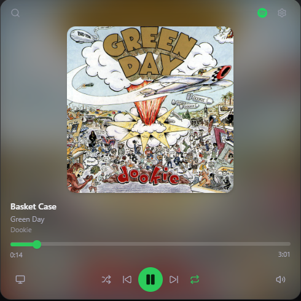
  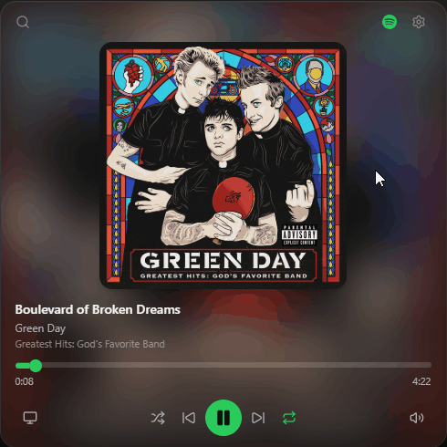

### Stocks

A watchlist with live prices and a chart.

- **Watchlist** — add symbols and drag to reorder. Each row shows the price, the day's change, and
  a sparkline.
- **Ticker detail** — an interactive chart across ranges, plus the day's range, 52-week range, and
  volume.
- **Market indices** — an optional strip with the S&P 500, Nasdaq, and Dow above the watchlist.

  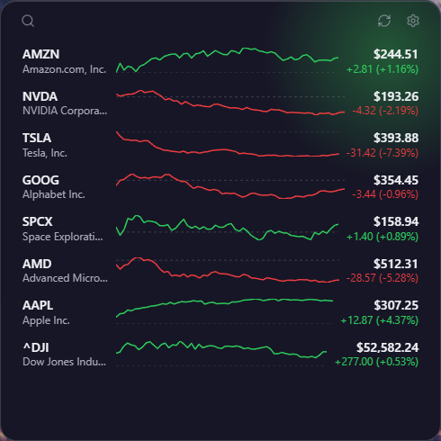
  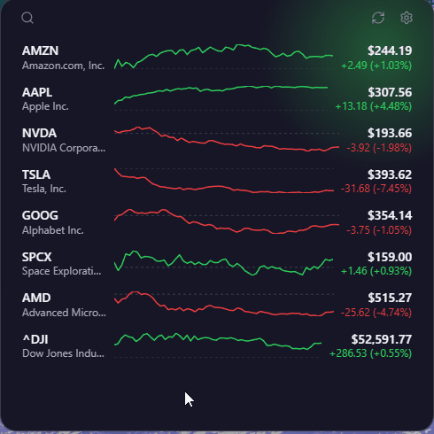

### Tasks

A to-do list that stays on this machine.

- **Add, check off, reorder** — type to add, click to complete, and drag to reorder. There's a
  running done / left count.
- **Clearing up** — completed items strike through, and clear in one tap.

  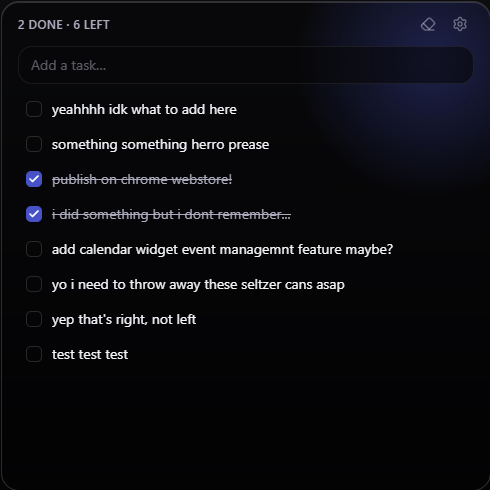
  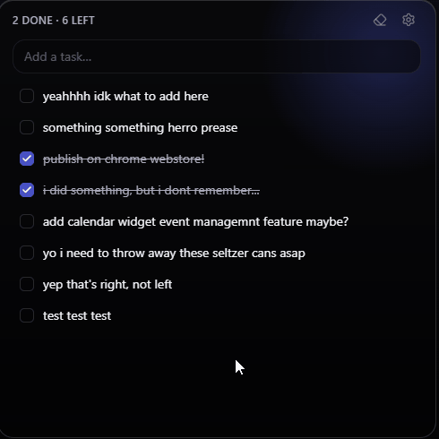

### Weather

Current conditions and forecasts for the places you add.

- **Your cities** — each city's current temperature with the day's high and low, and day or night
  icons.
- **City detail** — feels-like, humidity, wind, UV, sunrise and sunset, plus an hourly strip and a
  multi-day forecast.

  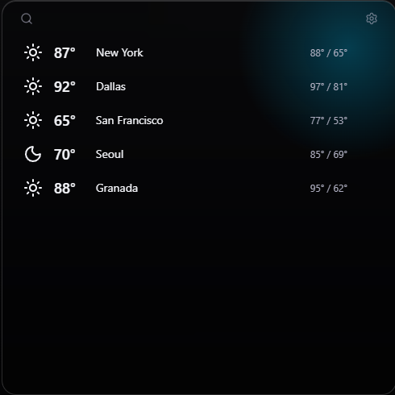
  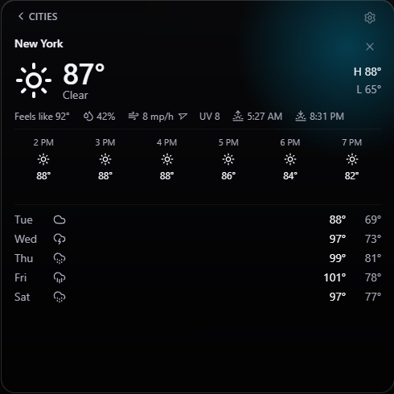

## Connecting accounts

Four widgets can connect to an account over OAuth, each only when you start the connection:

- **Google Calendar / Outlook** — read-only calendar events.
- **Spotify** — what's playing, and playback control.
- **GitHub** — contributions and notifications.
- **AniList** — library, progress, and notifications.

Requests go from your browser to the provider, and you can disconnect any of them from settings.

> **Connecting Google Calendar:** Lux's Google verification is still in review, so you may see a
> "Google hasn't verified this app" screen. To continue, choose **Advanced**, then
> **Go to lux.hyunwk.me**. Lux asks for read-only calendar access.

## Privacy

Your dashboard lives on your machine: layout, widget settings, and account tokens are kept in
`chrome.storage.local`. There's no Lux account and no analytics of any kind.

The one server Lux operates is a small stateless relay. It does two jobs — completing sign-in and
refreshing tokens for the providers whose token exchange needs a client secret (Google, Microsoft,
GitHub), and forwarding feedback you write and submit yourself — and it stores nothing. Everything
else talks to the provider directly from your browser.

Full policy: <https://lux.hyunwk.me/privacy>.

## Contributing

Lux is maintained solo and isn't taking pull requests right now, but bug reports are welcome, and
you're free to fork it under MIT. See [CONTRIBUTING.md](CONTRIBUTING.md).

## License

[MIT](LICENSE) © Hyunwoo Kim
